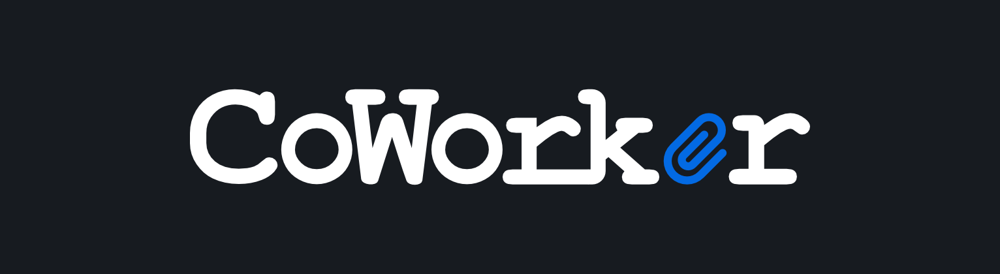
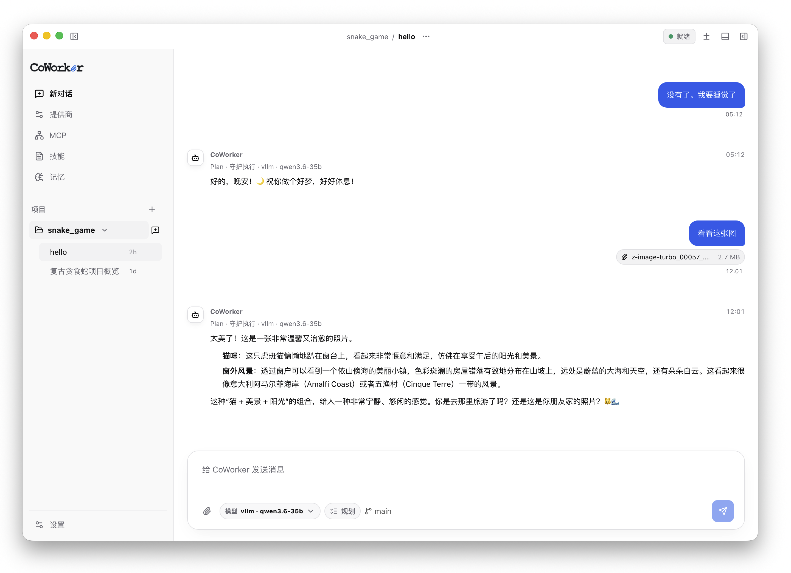
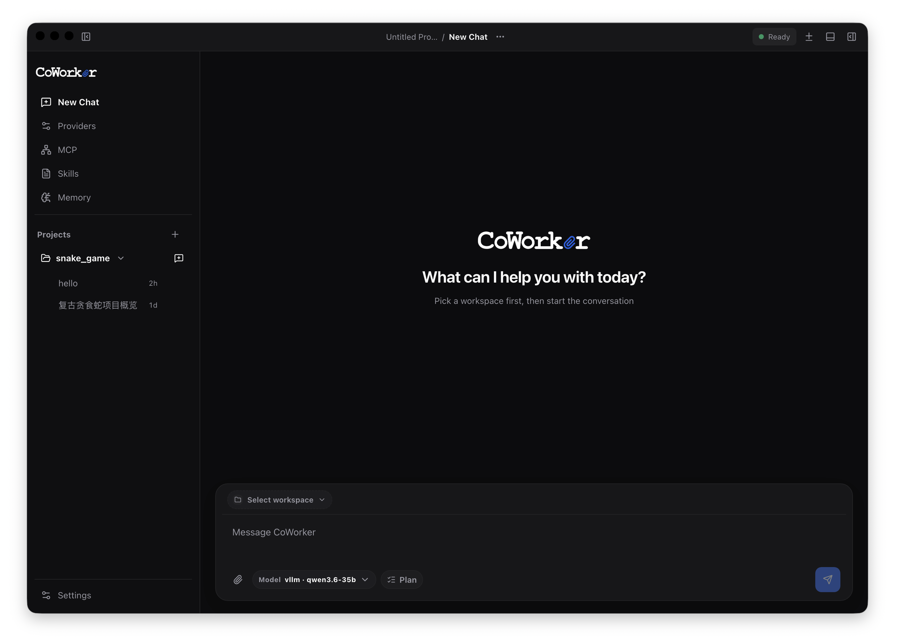

# Coworker Agent

> Local-first AI coding assistant desktop app — multi-provider, single-agent with HITL, memory, and extensible skills.

| macOS | Windows | Linux |
|---|---|---|
| [Download .dmg](https://github.com/leonjackman/coworker/releases) | [Download .exe](https://github.com/leonjackman/coworker/releases) | [Download .AppImage](https://github.com/leonjackman/coworker/releases) |

[](LICENSE)
[](https://github.com/leonjackman/coworker/actions/workflows/release.yml)
[](https://github.com/leonjackman/coworker/releases/latest)

[English](README.md) · [简体中文](README.zh-CN.md)



---

### Screenshots

| Dark Theme | Light Theme |
|---|---|
|  |  |

---

## Features

| Category | What it does |
|---|---|
| 🧠 **Long-Term Memory** | Project- and user-scoped memory with LLM auto-extract proposals that humans review. Drift-protected store with atomic writes. |
| 🔄 **Goal Mode** | Persistent multi-turn autonomous execution with pause, resume, edit, and stop — the agent loops across thousands of tool calls. |
| 🔒 **HITL by Default** | Human-in-the-loop approval before commands, file writes, MCP calls, and memory changes. Three autonomy levels: supervised, guarded, autonomous. |
| 🔌 **MCP + Skills** | Full Model Context Protocol integration with auto-discovery, persistent sessions, and OAuth. Skill marketplace (Tencent SkillHub / ClawHub). |
| 🌐 **Multi-Provider** | Any OpenAI-compatible API, Ollama, custom endpoints — not tied to any single vendor. |
| 📦 **Truly Local** | All data on your machine. API keys in Keychain, sessions as JSON, no cloud dependency. MIT licensed. |
| 📓 **Change Tracking & Rollback** | Every file change recorded with full before/after. Revert workspace to any past message with hunk-level conflict-safe undo. |
| 🎨 **i18n + Theme** | Chinese/English interface. Dark/light themes with custom accent color and translucent glass effect. |

---

## Install

> **Pre-release** — Coworker is under active development. Features are added and improved regularly. Download to try it out, report bugs, and help shape the road ahead.

Pre-built installers are available from [GitHub Releases](https://github.com/leonjackman/coworker/releases).

| Platform | What to download | Notes |
|----------|-----------------|-------|
| **macOS (Apple Silicon)** | `Coworker-*.dmg` | Universal build (ARM64). Unsigned / un-notarized. First launch may need `xattr -d com.apple.quarantine /Applications/Coworker.app`. |
| **Windows 10+** | `Coworker Setup *.exe` | x64 NSIS installer. May trigger SmartScreen warnings until code signing is added. |
| **Linux (x64)** | `Coworker-*.AppImage` | Requires FUSE. Make executable first (`chmod +x`). |

---

## Quick Start

### Desktop App

```bash
./coworker_desktop.command
```

This launcher script does everything:

1. Creates or reuses `backend/venv`
2. Installs Python and Node dependencies
3. Builds the Vite frontend
4. Starts FastAPI on `127.0.0.1:9527`
5. Launches the Electron app

For smoke testing without opening the desktop window:

```bash
COWORKER_SKIP_DESKTOP=1 ./coworker_desktop.command
```

### Configure a Provider

Open **Settings → Providers** in the app UI to add an OpenAI-compatible provider:

- Set the base URL, model name, and API key
- The key is stored in the OS Keychain (macOS) or a 0600-protected file (fallback)
- Test connectivity with the built-in "Test" button

For local models via Ollama:

```bash
# In Settings > Providers:
Base URL: http://localhost:11434/v1
Model: your_model_name
```

---

## Development

### Backend

```bash
cd backend
python3 -m venv venv
source venv/bin/activate
pip install -r requirements.txt
uvicorn main:app --host 127.0.0.1 --port 9527
```

### Frontend

```bash
cd frontend
npm install
npm run dev
```

### Full Dev Mode

```bash
# In terminal 1 — start FastAPI
cd backend && source venv/bin/activate && uvicorn main:app --host 127.0.0.1 --port 9527

# In terminal 2 — start Vite dev server
cd frontend && npm run dev

# In terminal 3 — launch Electron with Vite dev server
NODE_ENV=development npx electron . --no-sandbox
```

---

## Verification

```bash
cd frontend && npx tsc --noEmit
backend/venv/bin/python -m compileall backend/main.py backend/coworker
backend/venv/bin/python -m coworker.memory.selftest
COWORKER_SKIP_DESKTOP=1 ./coworker_desktop.command
```

---

## Technology Stack

| Layer | Technologies |
|-------|-------------|
| **Desktop** | Electron 43 · contextBridge · system tray · electron-updater |
| **Frontend** | React 19 · Vite 8 · Zustand · assistant-ui · Tailwind CSS 4 · Shiki · xterm.js |
| **Backend** | Python 3 · FastAPI · Uvicorn · Pydantic · SQLite |
| **Agent Runtime** | LangChain · LangGraph · SqliteSaver checkpointer · HumanInTheLoopMiddleware |
| **LLM Support** | OpenAI-compatible APIs · Ollama · custom base URLs |
| **Extensibility** | MCP servers (stdio/HTTP/SSE/WebSocket) · SKILL.md skills · Skill marketplace |
| **i18n** | English / Chinese (zh) |

---

## Contributing

> **Bug reports & feedback** — Coworker is an evolving project. If something doesn't work, please [open an issue](https://github.com/leonjackman/coworker/issues) with steps to reproduce. We'll fix it.

Contributions are welcome! Please read [CONTRIBUTING.md](CONTRIBUTING.md) before submitting a PR.

- Report bugs and request features on [Issues](https://github.com/leonjackman/coworker/issues)
- Check [docs/tasklist/DEV-TASKS.md](docs/tasklist/DEV-TASKS.md) for the current development plan

---

## License

MIT — see [LICENSE](LICENSE).

Built by [Coworker Contributors](https://github.com/leonjackman/coworker).
